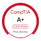

## 👨‍💻 About Me
Security-focused scripter with experience across Python, Bash, C, Assembly, and Perl.  
I build tools for reverse engineering, exploitation, and automation, using frameworks like angr, pwntools, pyelftools, and Ghidra.  
Interested in low-level security, exploit development, and capabilities engineering.

## 🧭 Programming Journey

- **2016** — Began programming at 15, writing small VBS and Batch scripts for Windows automation and experimentation.
- **2017–2019** — Shifted into Python and Bash; explored system internals and began learning C and low-level concepts.
- **High School Years** — Focused heavily on Python development and cybersecurity; participated in CTFs including Hack The Box and PicoCTF. Began exploring reverse engineering and exploitation fundamentals.
- **2020–2022** — Expanded into Assembly, C, and security-oriented tooling. Built early automation utilities and experimented with exploit workflows.
- **2023–2025** — Earned CompTIA A+, Network+, Security+, PenTest+, and CCNA. Developed deeper interest in reverse engineering and exploit development.
- **Present** — Working with tools like Ghidra, angr, pyelftools, pwntools, GEF/GDB, and custom Python/C/Assembly scripts to build reversing and exploitation automation tools.
- **Future Direction** — Advancing toward exploit development, low-level security engineering, and long-term specialization as a capabilities development specialist.

## 🌐 Socials:
 

## 🏅 Certifications

  

# 💻 Tech Stack:
    
# 📊 GitHub Stats:
 
 

## 🏆 GitHub Trophies

---

<!-- Proudly created with GPRM ( https://gprm.itsvg.in ) -->
